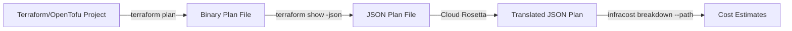

# Infracost Integration Documentation

## Overview

Cloud Rosetta integrates with Infracost through a **JSON plan file workflow**, not through direct API calls or HCL generation. The integration follows a three-step process: plan generation, translation, and cost estimation.

## Integration Architecture



## Detailed Integration Flow

### 1. Plan Generation Phase

When you run `rosetta --provider aws`, the tool first generates a Terraform plan:

```python
# From rosetta CLI (_generate_plan method)
def _generate_plan(self, tf_tool: str) -> str:
    # Generate binary plan file
    subprocess.run([tf_tool, "plan", "-out=tf.plan"])
    
    # Convert to JSON format
    result = subprocess.run([tf_tool, "show", "-json", "tf.plan"])
    
    # Save JSON plan
    with open("tfplan.json", 'w') as f:
        f.write(result.stdout)
    
    return "tfplan.json"
```

### 2. Translation Phase (if needed)

If the source provider differs from the target provider, Rosetta translates the JSON plan:

```python
# Translation logic
if source_provider != target_provider:
    # Load the JSON plan
    with open(plan_file, 'r') as f:
        plan_data = json.load(f)
    
    # Translate using database mappings
    translator = RosettaTranslator(plan_data, database_path)
    translated_plan = translator.translate(provider)
    
    # Save translated JSON plan
    output_file = f"tfplan_{provider}.json"
    with open(output_file, 'w') as f:
        json.dump(translated_plan, f, indent=2)
```

### 3. Cost Estimation Phase

Infracost is called as a subprocess with the JSON plan file:

```python
# From _run_infracost method
subprocess.run([
    "infracost", "breakdown",
    "--path", plan_file,        # Path to JSON plan file
    "--format", format           # Output format (table/json/html)
])
```

## Key Points

### What Rosetta Does:
1. **Generates JSON plan files** from Terraform/OpenTofu projects
2. **Translates resource types** in the JSON structure (e.g., `openstack_compute_instance_v2` → `aws_instance`)
3. **Maps instance types** (e.g., OVH `b2-15` → AWS `m5.xlarge`)
4. **Updates provider configurations** in the JSON
5. **Passes the modified JSON plan** to Infracost

### What Rosetta Does NOT Do:
- Does not generate HCL/Terraform files
- Does not call Infracost APIs directly
- Does not modify the original Terraform configuration
- Does not require AWS credentials for cost estimation

## JSON Plan Structure

The translated JSON plan maintains Terraform's standard structure:

```json
{
  "format_version": "0.1",
  "terraform_version": "1.5.0",
  "planned_values": {
    "root_module": {
      "resources": [
        {
          "address": "aws_instance.web",
          "type": "aws_instance",          // Translated from openstack_compute_instance_v2
          "values": {
            "instance_type": "m5.xlarge",  // Translated from flavor_name: "b2-15"
            "ami": "ami-12345678",          // Translated from image_name
            "availability_zone": "us-east-1a"  // Translated from region
          }
        }
      ]
    }
  },
  "resource_changes": [
    // Similar translated structure
  ],
  "configuration": {
    "provider_config": {
      "aws": {  // Updated from openstack
        "name": "aws",
        "version_constraint": "~> 5.0"
      }
    }
  }
}
```

## Infracost Configuration

Infracost reads the JSON plan file and:
1. Identifies AWS resource types
2. Applies its internal pricing database
3. Calculates costs based on resource specifications
4. Outputs results in the requested format

### Supported Output Formats
- `table` - Human-readable table (default)
- `json` - Machine-readable JSON
- `html` - HTML report

## File Flow Example

```bash
# Starting with OVH Terraform project
main.tf (OVH configuration)
    ↓
terraform plan -out=tf.plan
    ↓
tf.plan (binary)
    ↓
terraform show -json tf.plan
    ↓
tfplan.json (OVH resources in JSON)
    ↓
Cloud Rosetta translation
    ↓
tfplan_aws.json (AWS resources in JSON)
    ↓
infracost breakdown --path tfplan_aws.json
    ↓
Cost estimates (as AWS proxy pricing)
```

## Requirements

1. **Terraform or OpenTofu**: To generate the initial plan
2. **Infracost CLI**: To perform cost estimation
3. **No cloud credentials required**: Works with plan files only

## Limitations

1. **Proxy Pricing**: Non-AWS providers use AWS pricing as a proxy
2. **Resource Coverage**: Only resources with database mappings are translated
3. **Plan File Format**: Requires Terraform JSON plan format (not HCL)

## Installation Check

```bash
# Verify Infracost is installed
infracost --version

# Verify Terraform/OpenTofu
terraform --version
# or
tofu --version
```

## Troubleshooting

### Common Issues:

1. **"Infracost not found"**
   - Install from: https://www.infracost.io/docs/
   
2. **"Neither terraform nor tofu found"**
   - Install Terraform or OpenTofu
   
3. **Translation produces empty costs**
   - Check if resources are mapped in the database
   - Verify the JSON plan structure

## Advanced Usage

### Using Pre-generated Plans

```bash
# Generate plan manually
terraform plan -out=myplan.tfplan
terraform show -json myplan.tfplan > myplan.json

# Use with Rosetta
./rosetta --plan-file myplan.json --provider aws
```

### Direct Infracost Usage

After translation, you can use Infracost directly:

```bash
# Use the translated plan
infracost breakdown --path tfplan_aws.json

# Generate detailed report
infracost breakdown --path tfplan_aws.json --format json > costs.json
```

## Summary

The Rosetta-Infracost integration is **file-based**, not API-based. Rosetta acts as a translator between cloud providers by modifying JSON plan files, which Infracost then consumes to generate cost estimates. This approach requires no cloud credentials and works entirely with local files.