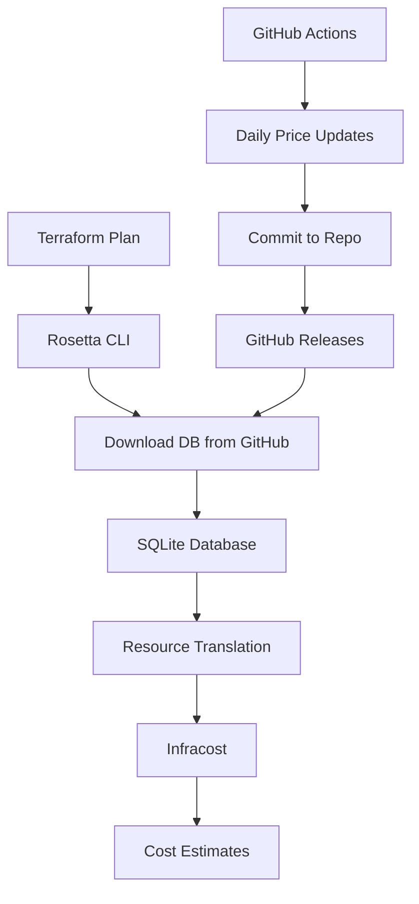

# Cloud Rosetta - Universal Terraform Cost Translator

Automatically translate Terraform plans between cloud providers (AWS, OVH, Hetzner, Azure, GCP) and estimate costs using Infracost. Features a comprehensive SQLite database of cloud resource mappings, daily pricing updates via GitHub Actions, and a simple CLI.

## Quick Start

### Installation Options

**Option 1: Complete Installation (Recommended)**
```bash
curl -fsSL https://raw.githubusercontent.com/gordonmurray/cloud-rosetta/main/install.sh | bash
```

**Option 2: Manual Download**
```bash
# Download the CLI tool
curl -O https://raw.githubusercontent.com/gordonmurray/cloud-rosetta/main/rosetta
chmod +x rosetta

# Download required dependencies
mkdir -p scripts/
curl -o scripts/translator.py https://raw.githubusercontent.com/gordonmurray/cloud-rosetta/main/scripts/translator.py
curl -o scripts/database_manager.py https://raw.githubusercontent.com/gordonmurray/cloud-rosetta/main/scripts/database_manager.py
```

**Option 3: Clone Repository**
```bash
git clone https://github.com/gordonmurray/cloud-rosetta.git
cd cloud-rosetta
```

### Usage
```bash
# Use in any Terraform project
terraform plan
./rosetta --provider aws      # Get AWS costs
./rosetta --provider ovh      # Translate to OVH and estimate costs  
./rosetta --provider hetzner  # Translate to Hetzner and estimate costs
```

## Features

- **Universal Translation**: Convert between AWS ↔ OVH ↔ Hetzner ↔ Azure ↔ GCP
- **Cost Estimation**: Uses Infracost with intelligent provider mapping
- **Comprehensive Database**: 79+ resource types, 76+ instance types
- **Auto-Updates**: Daily pricing updates via GitHub Actions
- **No Dependencies**: Single binary, auto-downloads database
- **Enterprise Ready**: Offline capability, version control, rollbacks

## Use Cases

### Multi-Cloud Planning
```bash
# Compare costs across providers for the same infrastructure
terraform plan
./rosetta --provider aws      # $45.67/month
./rosetta --provider ovh      # ~$32/month (estimated)
./rosetta --provider hetzner  # ~$28/month (estimated)
```

### Migration Cost Analysis
```bash
# Estimate savings when moving from AWS to OVH
./rosetta --provider aws      # Current AWS costs
./rosetta --provider ovh      # Projected OVH costs
```

### Procurement & Budgeting
```bash
# Get cost estimates for procurement without cloud accounts
./rosetta --provider hetzner --format json > budget.json
```

## Supported Resources

<details>
<summary>View all supported resource types (79+)</summary>

### Compute & Instance Management
- Instances: `aws_instance` ↔ `openstack_compute_instance_v2` ↔ `hcloud_server`
- Launch Templates: `aws_launch_template`
- Auto Scaling: `aws_autoscaling_group`
- Key Pairs: `aws_key_pair` ↔ `openstack_compute_keypair_v2` ↔ `hcloud_ssh_key`

### Storage
- **Block Storage**: `aws_ebs_volume` ↔ `openstack_blockstorage_volume_v3` ↔ `hcloud_volume`
- **Object Storage**: `aws_s3_bucket` ↔ `openstack_objectstorage_container_v1`
- **File Systems**: `aws_efs_file_system`, `aws_fsx_lustre_file_system`
- **Snapshots**: `aws_ebs_snapshot` ↔ `openstack_blockstorage_snapshot_v3` ↔ `hcloud_snapshot`

### Networking
- **VPC/Networks**: `aws_vpc` ↔ `openstack_networking_network_v2` ↔ `hcloud_network`
- **Subnets**: `aws_subnet` ↔ `openstack_networking_subnet_v2` ↔ `hcloud_network_subnet`
- **Security Groups**: `aws_security_group` ↔ `openstack_networking_secgroup_v2` ↔ `hcloud_firewall`
- **Load Balancers**: `aws_lb` ↔ `openstack_lb_loadbalancer_v2` ↔ `hcloud_load_balancer`
- **Elastic IPs**: `aws_eip` ↔ `openstack_networking_floatingip_v2` ↔ `hcloud_floating_ip`

### Databases
- **Instances**: `aws_db_instance` ↔ `openstack_db_instance_v1`
- **Clusters**: `aws_db_cluster` ↔ `openstack_db_cluster_v1`
- **Caching**: `aws_elasticache_cluster`

### Containers & Serverless
- **Container Clusters**: `aws_ecs_cluster` ↔ `openstack_containerinfra_cluster_v1`
- **Kubernetes**: `aws_eks_cluster` ↔ `openstack_containerinfra_cluster_v1`
- **Functions**: `aws_lambda_function`
- **API Gateway**: `aws_api_gateway_rest_api`

### Monitoring & Management
- **CloudWatch**: `aws_cloudwatch_metric_alarm`, `aws_cloudwatch_log_group`
- **IAM**: `aws_iam_role`, `aws_iam_policy`, `aws_iam_user`
- **Backup**: `aws_backup_plan`, `aws_backup_vault`

</details>

## Architecture



### How It Works

1. **Plan Generation**: Rosetta generates a Terraform JSON plan file from your project
2. **Translation**: Resources are translated using the SQLite database mappings
3. **Cost Estimation**: The translated JSON plan is passed to Infracost for pricing
4. **No HCL Generation**: Works entirely with JSON plan files, not Terraform code

📖 **[Detailed Infracost Integration Documentation](INFRACOST_INTEGRATION.md)**

### Database Design

```sql
-- Resource mappings between providers
resource_mappings (aws_type, ovh_type, hetzner_type, category)

-- Instance types with detailed specs
instance_types (provider, instance_type, vcpu, memory_gb, hourly_price)

-- Regional mappings with geographic data
regions (provider, region_code, latitude, longitude)

-- OS/Image mappings
images (provider, image_name, os_family, os_version)
```

## Installation & Setup

### Option 1: Direct Download
```bash
curl -O https://raw.githubusercontent.com/gordonmurray/cloud-rosetta/main/rosetta
chmod +x rosetta
./rosetta --provider aws
```

### Option 2: Fork & Customize
```bash
# 1. Fork this repository
# 2. Update GitHub Actions secrets (optional)
# 3. Customize resource mappings in scripts/populate_db.py
# 4. Use your fork:
./rosetta --repo gordonmurray/cloud-rosetta --provider ovh
```

### Requirements
- Python 3.8+ (for the CLI script)
- [Infracost](https://www.infracost.io/docs/) (auto-installed on first run)
- [Terraform](https://terraform.io) or [OpenTofu](https://opentofu.org)

## Cost Accuracy

Our database provides intelligent mappings based on:

### Instance Type Mapping
- **Hardware specs**: vCPU count, RAM, storage
- **Performance class**: General purpose, compute optimized, memory optimized  
- **Generation**: Current vs previous generation

### Regional Mapping
- **Geographic proximity**: Nearest data center
- **Continent preference**: Same continent when possible
- **Pricing zones**: Similar cost regions

### Example Mappings
| OVH | AWS | Hetzner | Notes |
|-----|-----|---------|-------|
| d2-2 (1 vCPU, 2GB) | t3.small | cx11 | Entry-level instances |
| b2-15 (4 vCPU, 15GB) | m5.xlarge | cpx31 | General purpose |
| c2-30 (8 vCPU, 30GB) | c5.2xlarge | ccx31 | Compute optimized |
| r2-60 (8 vCPU, 60GB) | r5.2xlarge | ccx41 | Memory optimized |

### Pricing Accuracy
- **AWS**: Direct Infracost pricing (100% accurate)
- **OVH**: AWS pricing as proxy (~70-80% of actual OVH costs)
- **Hetzner**: AWS pricing as proxy (~50-60% of actual Hetzner costs)
- **Daily updates**: Pricing refreshed automatically


## Examples

<details>
<summary>View real-world examples</summary>

### Example 1: Simple Web Server
```hcl
# main.tf
resource "aws_instance" "web" {
  instance_type = "t3.medium"
  ami           = "ami-ubuntu-22.04"
}

resource "aws_ebs_volume" "storage" {
  size = 100
  type = "gp3"
}
```

```bash
terraform plan
./rosetta --provider aws      # $30.45/month
./rosetta --provider ovh      # ~$21/month (estimated)
./rosetta --provider hetzner  # ~$18/month (estimated)
```

### Example 2: Multi-tier Application
```hcl
resource "aws_instance" "web" {
  count         = 2
  instance_type = "m5.large" 
}

resource "aws_db_instance" "postgres" {
  instance_class = "db.t3.medium"
  allocated_storage = 100
}

resource "aws_lb" "main" {
  load_balancer_type = "application"
}
```

```bash
./rosetta --provider aws      # $156.78/month
./rosetta --provider ovh      # ~$110/month (estimated)  
./rosetta --provider hetzner  # ~$95/month (estimated)
```

</details>

## Technical Documentation

- **[Infracost Integration Details](INFRACOST_INTEGRATION.md)** - How Rosetta works with Infracost
- **[Database Schema](scripts/database_manager.py)** - SQLite database structure
- **[Translation Logic](scripts/translator.py)** - Resource mapping implementation

## Contributing

### Adding New Providers
1. Fork the repository
2. Add provider mappings in `scripts/populate_db.py`
3. Update the CLI in `rosetta` 
4. Add tests
5. Submit a PR

### Improving Mappings
1. Open an issue with the mapping problem
2. Provide resource specifications
3. Suggest better equivalent instances
4. We'll update the database

### Pricing Integration
1. Add pricing APIs to `scripts/fetch_pricing.py`
2. Update the database schema if needed
3. Test with real workloads
4. Document accuracy improvements

## License

MIT License - feel free to use in commercial projects.